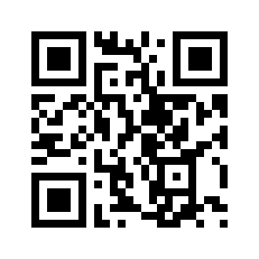

# Segno - QR Code Generation in Python (Cheat Sheet)

Segno is a pure Python library for creating QR codes and Micro QR codes. It's easy to use, versatile, and offers customization options.

## Installation:

```bash
pip install segno
```
## Basic Usage:

```python

import segno

qrcode = segno.make_qr("Hello, World")
qrcode.save("basic_qrcode.png")
```
## Data Types:

- Text
- URLs
- Email addresses
- vCards (contact information)
- Byte data

## Customization:

- `error_correction` (default=segno.M): Level of error correction (L, M, Q, H)
- `version` (default=None): QR code version (1-40)
- `data_mask` (default=segno.DATA_MASK_000): Data mask pattern

Example with Customization:

```python
import segno

data = "https://www.example.com"
qr = segno.make(
    data, error_correction=segno.H, version=7, data_mask=segno.DATA_MASK_011
)
qr.save("qr_code_custom.svg", kind="svg")
```

